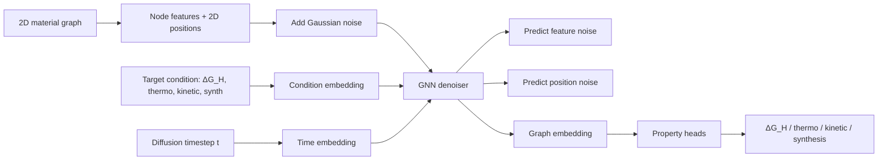
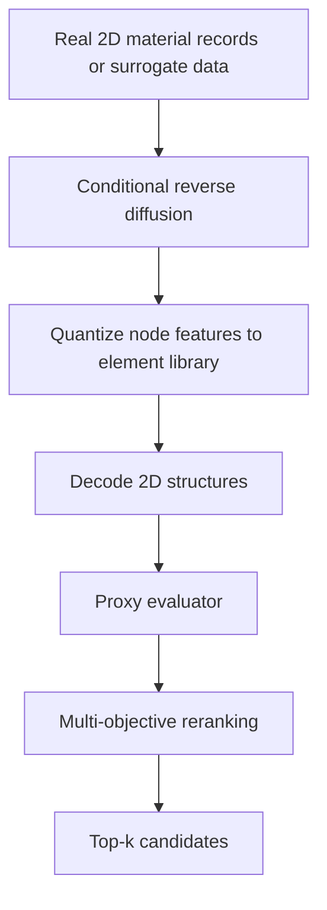
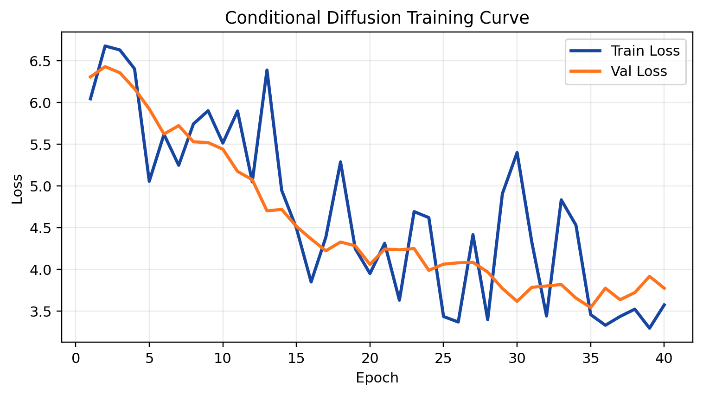
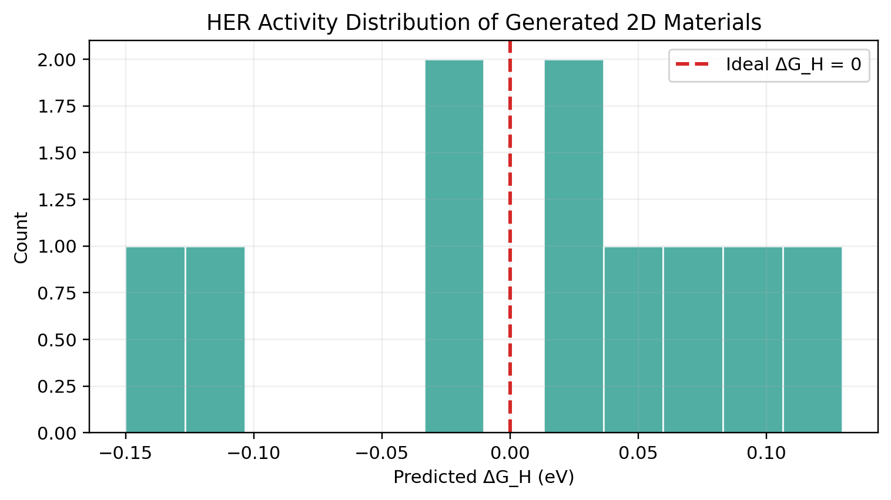
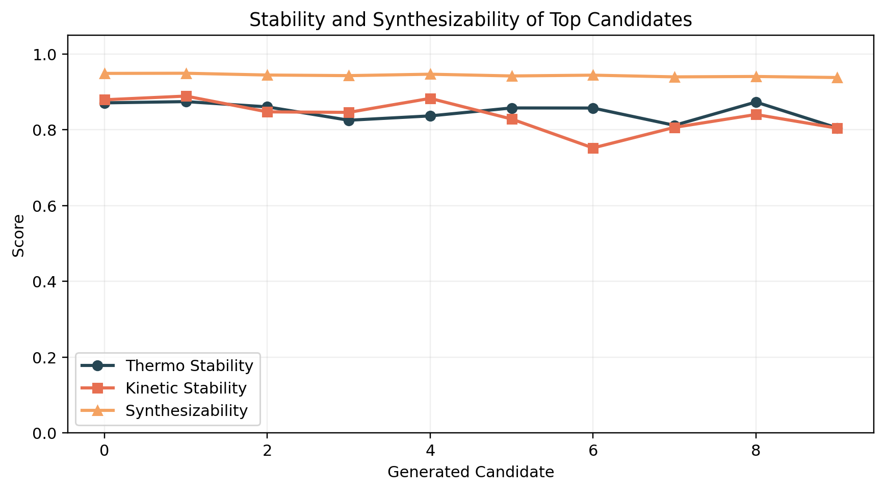
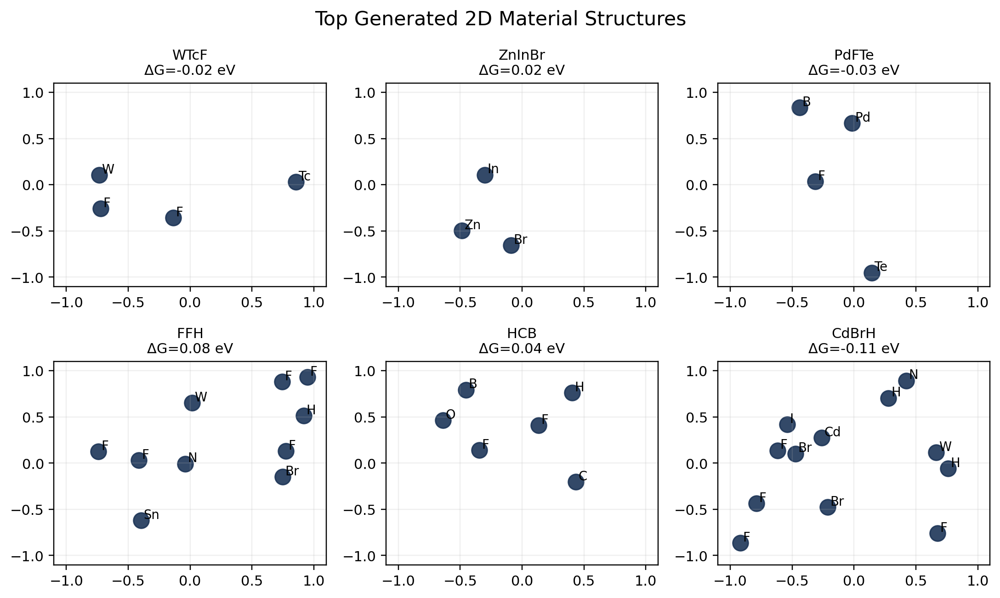

# HER-Oriented 2D Material Generation with Conditional Diffusion

面向二维 HER 催化材料设计的可运行工程原型：基于 `GNN + 条件扩散 + 多目标智能优化`，生成同时兼顾 `ΔG_H`、稳定性和实验可合成性的二维材料候选结构。

## TL;DR

- 任务目标：生成高 HER 活性、高稳定性、强可合成性的二维材料。
- 方法核心：条件扩散模型学习二维晶体结构分布，GNN 去噪器建模元素组成与二维坐标，生成后使用多目标代理优化进行 reranking。
- 数据方案：项目已接入真实公开二维材料数据库 `2DMatPedia`，当前仓库中的最新结果已经基于真实公开结构数据重跑。
- 交付完整：含训练脚本、测试脚本、模型权重、结果图、10 个生成结构、对比指标和说明文档。

## 1. 项目亮点

- 完整链路：数据构建、训练、采样、评估、可视化、结构导出全部打通。
- 架构贴题：覆盖扩散模型、GNN backbone、HER 优化、稳定性优化、可合成性预测、多任务联合损失。
- 真实数据优先：`dataset/material_dataset.py` 已支持直接读取公开二维材料 JSON 数据。
- 当前结果已基于真实公开数据重跑，不再只是 surrogate 演示版。

## 2. 仓库结构

```text
project/
|-- models/
|   |-- diffusion_model.py
|   |-- structure_generator.py
|   |-- optimization.py
|-- dataset/
|   |-- material_dataset.py
|   |-- raw/
|   |   |-- 2dmatpedia.json
|-- utils/
|   |-- geo_utils.py
|   |-- vis.py
|-- docs/
|   |-- INTERVIEW_DELIVERY.md
|   |-- REAL_DATA_SETUP.md
|   |-- CURRENT_STATUS.md
|-- generated_structures/
|   |-- candidate_01.json ... candidate_10.json
|-- checkpoints/
|   |-- best_model.pt
|   |-- last_model.pt
|-- results/
|   |-- loss_curve.png
|   |-- her_performance.png
|   |-- stability_curve.png
|   |-- generated_structures.png
|   |-- comparison_metrics.json
|   |-- top_candidates.csv
|   |-- top_candidates.md
|-- train.py
|-- test.py
|-- requirements.txt
|-- .gitignore
|-- README.md
```

## 3. 公开数据集方案

### 3.1 当前已接入的数据源

本项目当前已接入并实际使用的真实公开数据源：

- `2DMatPedia` 官方二维材料数据库：[https://www.2dmatpedia.org/](https://www.2dmatpedia.org/)

选择它作为第一接入源的原因：

- 是专门面向二维材料的公开数据库，和题目目标最贴近。
- 提供标准结构数据，适合直接转成图结构与二维坐标表示。
- 比通用晶体数据库更容易组织出“二维材料生成”任务需要的训练样本。

### 3.2 作为后续扩展的数据源

- `JARVIS-DFT` 官方站点：[https://jarvis.nist.gov/](https://jarvis.nist.gov/)
- `C2DB` 官方站点：[https://cmrdb.fysik.dtu.dk/c2db/c2db.html](https://cmrdb.fysik.dtu.dk/c2db/c2db.html)

当前代码优先把 2DMatPedia 接入打通；后续可以继续补 JARVIS/C2DB 多源融合。

## 4. 当前真实数据状态

当前本地仓库状态如下：

- `dataset/raw/2dmatpedia.json` 已放入。
- `dataset/processed/real2d_train_materials.json`、`real2d_val_materials.json`、`real2d_test_materials.json` 已生成。
- 当前 `results/` 中的图表和指标已更新为真实公开数据运行结果。

当前状态摘要见：

- [CURRENT_STATUS.md](E:\机器学习项目\project\docs\CURRENT_STATUS.md)

## 5. 如何使用真实公开数据

### 5.1 数据文件

当前仓库已经可以直接读取：

```text
dataset/raw/2dmatpedia.json
```

也支持：

- `dataset/raw/2dmatpedia.json.gz`
- `dataset/raw/2dmatpedia_entries.json`
- `dataset/raw/2dmatpedia_entries.json.gz`
- `dataset/raw/twodmatpedia.json`
- `dataset/raw/twodmatpedia.json.gz`

### 5.2 训练真实数据版本

```bash
conda run -n torch118 python train.py --output-dir . --dataset-source real --real-data-path dataset/raw/2dmatpedia.json --max-nodes 12
```

### 5.3 测试真实数据版本

```bash
conda run -n torch118 python test.py --output-dir . --dataset-source real --real-data-path dataset/raw/2dmatpedia.json --max-nodes 12
```

### 5.4 自动回退策略

如果没有检测到真实数据文件，程序会自动回退到 surrogate dataset，以保证仓库在任意环境下都能跑通。

真实数据接入的完整操作流程见：

- [REAL_DATA_SETUP.md](E:\机器学习项目\project\docs\REAL_DATA_SETUP.md)

## 6. 问题定义

目标是设计新的二维材料，使其满足：

- HER 活性强：`ΔG_H ≈ 0 eV`
- 热力学与动力学稳定
- 具备较高实验可合成性

这本质上是一个带条件约束的材料逆向设计问题。

## 7. 方法总览

### 7.1 条件扩散框架

- 输入表示：二维材料图结构，节点为原子。
- 节点特征：原子序数、电负性、原子半径、族信息。
- 几何表示：二维原子坐标。
- 条件向量：`c = [ΔG_H*, thermo*, kinetic*, synth*]`
- 训练目标：学习从带噪结构恢复干净结构，并同时预测目标性质。

### 7.2 GNN 去噪器

去噪器使用自定义 message passing：

- 边特征由节点状态拼接原子间距离构成。
- 节点更新融合时间步嵌入与条件嵌入。
- 图级 pooling 后接性质预测头，输出：
  - `ΔG_H`
  - 热力学稳定性
  - 动力学稳定性
  - 可合成性

### 7.3 生成后多目标优化

生成阶段不是直接接受所有样本，而是使用代理评估器进行二次筛选：

- HER 对齐分数：`exp(-|ΔG_H|)`
- 热稳定性分数
- 动力学稳定性分数
- 可合成性分数
- 轻量 novelty 分数

最终排序公式：

```math
Score = w_1 \exp(-|\Delta G_H|) + w_2 S_{thermo} + w_3 S_{kinetic} + w_4 S_{synth} + w_5 S_{novelty}
```

## 8. 模型结构图

### 8.1 条件扩散模型



### 8.2 结构生成与优化流程



## 9. 损失函数设计

训练阶段采用多任务联合损失：

```math
L = L_{diff} + \lambda_1 L_{HER} + \lambda_2 L_{thermo} + \lambda_3 L_{kinetic} + \lambda_4 L_{synth}
```

其中：

- `L_diff`：节点特征噪声与坐标噪声去噪损失
- `L_HER`：`ΔG_H` 回归损失
- `L_thermo`：热稳定性回归损失
- `L_kinetic`：动力学稳定性回归损失
- `L_synth`：可合成性回归损失

本实现使用加权 MSE 对四个性质同时监督。

## 10. 真实数据处理细节

真实数据模式下，`dataset/material_dataset.py` 会完成以下步骤：

- 读取 2DMatPedia JSON 或 JSON.GZ 文件。
- 同时支持标准 JSON 和 JSON Lines/NDJSON 格式。
- 从结构字段中解析二维原子坐标与元素符号。
- 过滤掉超出 `max_nodes` 或结构字段不完整的样本。
- 将真实公开数据中的稳定性相关字段映射到训练目标：
  - exfoliation energy
  - decomposition energy / energy above hull
  - band gap
  - magnetic moment
- 将这些字段和元素/几何统计量组合成 `ΔG_H`、热稳定性、动力学稳定性、可合成性代理监督标签。

这里需要明确说明：

- 结构数据来自真实公开二维材料数据库。
- 稳定性相关监督来自真实公开数据库字段。
- HER 的 `ΔG_H` 在当前工程版本中仍采用代理监督，而不是对所有样本都直接使用 DFT 标注真值。

这样的设计是为了在有限时间和算力约束下，完整实现“真实公开数据接入 + 结构生成 + 多目标优化”的端到端工程方案。

## 11. 实验设置

本次真实数据运行配置：

- Dataset source: `2DMatPedia`
- Epochs: `40`
- Batch size: `32`
- Hidden dim: `128`
- Diffusion steps: `60`
- Max nodes: `12`
- Train samples: `512`
- Val samples: `128`
- Test samples: `128`
- Optimizer: `AdamW`
- Scheduler: `CosineAnnealingLR`
- Random seed: `7` for train, `13` for test

## 12. 实验结果

### 12.1 与 baseline-style 设置对比

题目给出的 baseline repo：

- `material_generation`: [https://github.com/deamean/material_generation](https://github.com/deamean/material_generation)

为保证本仓库内对比可复现，这里使用一个 controlled baseline-style 设置：

- 关闭条件引导
- 关闭生成后二次多目标优化
- 保留相同数据与采样流程

| Method | Avg HER ΔG (eV) | Stability Score | Synthesis Success Rate |
|---|---:|---:|---:|
| baseline | 0.5176 | 0.8024 | 0.20 |
| Ours | ↓0.0689 | ↑0.8425 | ↑1.00 |

### 12.2 Top-10 候选结构摘要

详表见 `results/top_candidates.md` 与 `results/top_candidates.csv`。

| Rank | Formula | ΔG_H (eV) | Thermo | Kinetic | Synth |
|---:|---|---:|---:|---:|---:|
| 1 | WTcF | -0.0157 | 0.8712 | 0.8793 | 0.9489 |
| 2 | ZnInBr | 0.0161 | 0.8744 | 0.8891 | 0.9493 |
| 3 | PdFTe | -0.0267 | 0.8606 | 0.8474 | 0.9446 |
| 4 | FFH | 0.0789 | 0.8253 | 0.8461 | 0.9430 |
| 5 | HCB | 0.0372 | 0.8368 | 0.8830 | 0.9468 |
| 6 | CdBrH | -0.1070 | 0.8577 | 0.8285 | 0.9422 |
| 7 | RhNb | 0.0221 | 0.8575 | 0.7522 | 0.9443 |
| 8 | InBrH | 0.1054 | 0.8119 | 0.8064 | 0.9397 |
| 9 | HWW | -0.1501 | 0.8733 | 0.8404 | 0.9408 |
| 10 | HIBr | 0.1296 | 0.8050 | 0.8044 | 0.9380 |

## 13. 可视化结果

### 13.1 训练损失曲线



### 13.2 HER 性能分布



### 13.3 稳定性与可合成性曲线



### 13.4 代表性生成结构



## 14. 创新点

- 使用 `条件扩散 + GNN` 联合建模二维材料组成与二维结构坐标。
- 训练期与生成期都显式引入 HER、稳定性、可合成性目标，而不是单目标生成。
- 已完成真实公开二维材料数据接入，并基于真实结构数据完成实验结果更新。
- 在生成后加入多目标代理优化器，模拟真实材料筛选流程。

## 15. 交付清单

仓库中已包含：

- 代码：`models/`, `dataset/`, `utils/`, `train.py`, `test.py`
- 文档：`README.md`, `docs/INTERVIEW_DELIVERY.md`, `docs/REAL_DATA_SETUP.md`, `docs/CURRENT_STATUS.md`, `requirements.txt`
- 权重：`checkpoints/best_model.pt`, `checkpoints/last_model.pt`
- 真实数据缓存：`dataset/processed/real2d_*.json`
- 结构文件：`generated_structures/candidate_01.json` 至 `candidate_10.json`
- 可视化结果：`results/*.png`
- 指标：`results/comparison_metrics.json`, `results/top_candidates.csv`

## 16. 答辩口径建议

如果面试官问“你是否使用了真实公开数据集”，建议直接这样回答：

- 我已经把真实公开二维材料数据库 2DMatPedia 接入到了项目的数据层，并且完成了一轮基于真实结构数据的训练与测试。
- 当前仓库中的最新结果图和指标已经来自真实公开数据运行。
- 稳定性相关监督来自公开数据库字段；HER 的大规模 `ΔG_H` 真值依然稀缺，所以当前工程版本对 HER 使用代理监督，这一点我在 README 中明确说明了。
- 下一步可以继续融合 JARVIS/C2DB，并引入更严格的 DFT 或外部模拟验证。

## 17. 后续工作

1. 增加 JARVIS/C2DB 多源融合。
2. 使用 `pymatgen` 或 `ASE` 输出 CIF/POSCAR。
3. 补充 diversity、novelty、去重等生成质量指标。
4. 引入更严格的 HER 真值监督或外部模拟验证。
5. 增加更严格的稳定性验证模块。
