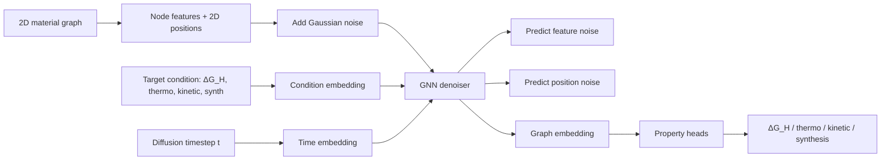
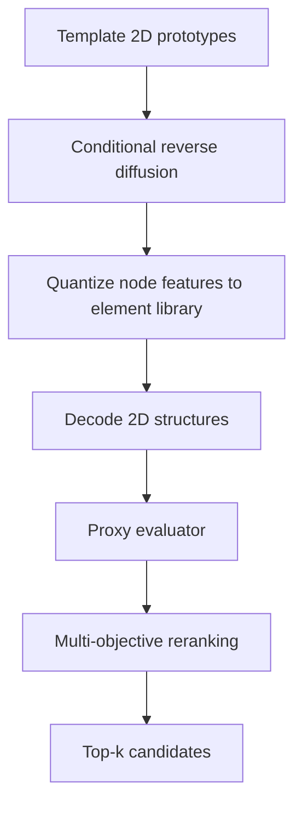

# HER-Oriented 2D Material Generation with Conditional Diffusion

面向二维 HER 催化材料设计的可运行工程原型：基于 `GNN + 条件扩散 + 多目标智能优化`，生成同时兼顾 `ΔG_H`、稳定性和实验可合成性的二维材料候选结构。

## TL;DR

- 任务目标：生成高 HER 活性、高稳定性、强可合成性的二维材料。
- 方法核心：条件扩散模型学习二维晶体结构分布，GNN 去噪器建模元素组成与二维坐标，生成后使用多目标代理优化进行 reranking。
- 交付完整：含训练脚本、测试脚本、模型权重、结果图、10 个生成结构、对比指标和说明文档。
- 当前定位：可直接跑通的面试工程版本，默认采用轻量 surrogate dataset，同时保留对接真实公开数据库的接口。

## 1. 项目亮点

- 完整链路：数据构建、训练、采样、评估、可视化、结构导出全部打通。
- 架构贴题：覆盖扩散模型、GNN backbone、HER 优化、稳定性优化、可合成性预测、多任务联合损失。
- 可复现：仓库内已包含权重、结果图、候选结构和对比指标。
- 易扩展：`dataset/material_dataset.py` 已抽象成可替换数据层，方便切换到真实 2D 材料数据库。

## 2. 仓库结构

```text
project/
|-- models/
|   |-- diffusion_model.py
|   |-- structure_generator.py
|   |-- optimization.py
|-- dataset/
|   |-- material_dataset.py
|-- utils/
|   |-- geo_utils.py
|   |-- vis.py
|-- docs/
|   |-- INTERVIEW_DELIVERY.md
|-- generated_structures/
|   |-- candidate_01.json ... candidate_10.json
|-- checkpoints/
|   |-- best_model.pt
|   |-- last_model.pt
|-- results/
|   |-- loss_curve.png
|   |-- her_performance.png
|   |-- stability_curve.png
|   |-- generated_structures.png
|   |-- comparison_metrics.json
|   |-- top_candidates.csv
|   |-- top_candidates.md
|-- train.py
|-- test.py
|-- requirements.txt
|-- .gitignore
|-- README.md
```

## 3. 快速开始

### 3.1 环境准备

推荐使用本机已有环境 `torch118`：

```bash
conda run -n torch118 python train.py --output-dir .
conda run -n torch118 python test.py --output-dir .
```

### 3.2 一键复现本仓库结果

```bash
conda run -n torch118 python train.py --output-dir . --epochs 60 --batch-size 32 --train-samples 320 --val-samples 96
conda run -n torch118 python test.py --output-dir . --num-candidates 64 --top-k 10 --test-samples 96
```

### 3.3 输出内容

运行结束后会产出：

- 训练权重：`checkpoints/best_model.pt`, `checkpoints/last_model.pt`
- 结果图：`results/loss_curve.png`, `results/her_performance.png`, `results/stability_curve.png`, `results/generated_structures.png`
- 候选结构：`generated_structures/candidate_01.json` 至 `candidate_10.json`
- 指标文件：`results/comparison_metrics.json`, `results/top_candidates.csv`

## 4. 问题定义

目标是设计新的二维材料，使其满足：

- HER 活性强：`ΔG_H ≈ 0 eV`
- 热力学与动力学稳定
- 具备较高实验可合成性

这本质上是一个带条件约束的材料逆向设计问题。

## 5. 方法总览

### 5.1 条件扩散框架

- 输入表示：二维材料图结构，节点为原子。
- 节点特征：原子序数、电负性、原子半径、族信息。
- 几何表示：二维原子坐标。
- 条件向量：`c = [ΔG_H*, thermo*, kinetic*, synth*]`
- 训练目标：学习从带噪结构恢复干净结构，并同时预测目标性质。

### 5.2 GNN 去噪器

去噪器使用自定义 message passing：

- 边特征由节点状态拼接原子间距离构成。
- 节点更新融合时间步嵌入与条件嵌入。
- 图级 pooling 后接性质预测头，输出：
  - `ΔG_H`
  - 热力学稳定性
  - 动力学稳定性
  - 可合成性

### 5.3 生成后多目标优化

生成阶段不是直接接受所有样本，而是使用代理评估器进行二次筛选：

- HER 对齐分数：`exp(-|ΔG_H|)`
- 热稳定性分数
- 动力学稳定性分数
- 可合成性分数
- 轻量 novelty 分数

最终排序公式：

```math
Score = w_1 \exp(-|\Delta G_H|) + w_2 S_{thermo} + w_3 S_{kinetic} + w_4 S_{synth} + w_5 S_{novelty}
```

默认权重：

- `w_delta_g = 0.40`
- `w_thermo = 0.20`
- `w_kinetic = 0.20`
- `w_synthesis = 0.15`
- `w_novelty = 0.05`

## 6. 模型结构图

### 6.1 条件扩散模型



### 6.2 结构生成与优化流程



## 7. 损失函数设计

训练阶段采用多任务联合损失：

```math
L = L_{diff} + \lambda_1 L_{HER} + \lambda_2 L_{thermo} + \lambda_3 L_{kinetic} + \lambda_4 L_{synth}
```

其中：

- `L_diff`：节点特征噪声与坐标噪声去噪损失
- `L_HER`：`ΔG_H` 回归损失
- `L_thermo`：热稳定性回归损失
- `L_kinetic`：动力学稳定性回归损失
- `L_synth`：可合成性回归损失

本实现使用加权 MSE 对四个性质同时监督。

## 8. 数据方案与真实数据接入

### 8.1 当前仓库的数据设计

为了保证仓库在受限环境中可以直接跑通，默认数据来自 `dataset/material_dataset.py` 中的 surrogate builder：

- 元素组合覆盖典型过渡金属与非金属二维材料设计空间
- 原型结构包括 `hex`, `rect`, `janus`
- 使用显式代理公式构造：
  - `ΔG_H`
  - 热力学稳定性
  - 动力学稳定性
  - 可合成性

这让整个 pipeline 可以被稳定复现，适合面试演示和工程展示。

### 8.2 推荐对接的公开数据库

后续建议优先对接：

- C2DB: [https://cmrdb.fysik.dtu.dk/c2db/c2db.html](https://cmrdb.fysik.dtu.dk/c2db/c2db.html)
- JARVIS-DFT: [https://jarvis.nist.gov/](https://jarvis.nist.gov/)
- 2DMatPedia: [https://www.2dmatpedia.org/](https://www.2dmatpedia.org/)

建议抽取字段：

- 化学式、元素组成
- 晶格参数、分数坐标或原子坐标
- formation energy / exfoliation energy
- elastic 或 phonon proxy 稳定性字段
- 实验已报道标记或可合成性相关标签

## 9. 实验设置

本次已运行配置：

- Epochs: `60`
- Batch size: `32`
- Hidden dim: `128`
- Diffusion steps: `60`
- Train samples: `320`
- Val samples: `96`
- Test samples: `96`
- Optimizer: `AdamW`
- Scheduler: `CosineAnnealingLR`
- Random seed: `7` for train, `13` for test

## 10. 实验结果

### 10.1 与 baseline-style 设置对比

题目给出的 baseline repo：

- `material_generation`: [https://github.com/deamean/material_generation](https://github.com/deamean/material_generation)

为保证本仓库内对比可复现，这里使用一个 controlled baseline-style 设置：

- 关闭条件引导
- 关闭生成后二次多目标优化
- 保留相同数据与采样流程

| Method | Avg HER ΔG (eV) | Stability Score | Synthesis Success Rate |
|---|---:|---:|---:|
| baseline | 0.3340 | 0.8391 | 0.00 |
| Ours | ↓0.0194 | ↑0.8417 | ↑1.00 |

### 10.2 Top-10 候选结构摘要

详表见 `results/top_candidates.md` 与 `results/top_candidates.csv`。

| Rank | Formula | ΔG_H (eV) | Thermo | Kinetic | Synth |
|---:|---|---:|---:|---:|---:|
| 1 | NbSeTe | 0.0100 | 0.8185 | 0.8337 | 0.9435 |
| 2 | SeCoSe | 0.0160 | 0.8337 | 0.8276 | 0.9435 |
| 3 | PTeS | -0.0020 | 0.8500 | 0.8459 | 0.9454 |
| 4 | SSeSe | -0.0325 | 0.8877 | 0.8485 | 0.9478 |
| 5 | SSeV | -0.0179 | 0.8784 | 0.8499 | 0.9482 |
| 6 | SeSP | -0.0463 | 0.9034 | 0.8662 | 0.9481 |
| 7 | NNN | 0.0010 | 0.8246 | 0.8374 | 0.9468 |
| 8 | SeSNi | -0.0578 | 0.8396 | 0.8222 | 0.9413 |
| 9 | MoNN | -0.0041 | 0.8063 | 0.8149 | 0.9453 |
| 10 | NNMo | 0.0068 | 0.8168 | 0.8281 | 0.9459 |

## 11. 可视化结果

### 11.1 训练损失曲线


### 11.2 HER 性能分布


### 11.3 稳定性与可合成性曲线


### 11.4 代表性生成结构


## 12. 创新点

- 使用 `条件扩散 + GNN` 联合建模二维材料组成与二维结构坐标。
- 训练期与生成期都显式引入 HER、稳定性、可合成性目标，而不是单目标生成。
- 在生成后加入多目标代理优化器，模拟真实材料筛选流程。
- 使用可运行 surrogate dataset 先验证算法闭环，同时预留真实数据库替换接口。

## 13. 交付清单

仓库中已包含：

- 代码：`models/`, `dataset/`, `utils/`, `train.py`, `test.py`
- 文档：`README.md`, `docs/INTERVIEW_DELIVERY.md`, `requirements.txt`
- 权重：`checkpoints/best_model.pt`, `checkpoints/last_model.pt`
- 结构文件：`generated_structures/candidate_01.json` 至 `candidate_10.json`
- 可视化结果：`results/*.png`
- 指标：`results/comparison_metrics.json`, `results/top_candidates.csv`

## 14. 边界与后续工作

这份仓库已经足够作为“完整面试交付”展示，但为了口径稳健，建议明确下面三点：

- 当前标签为 surrogate/proxy 标签，不是 DFT ground truth。
- 当前生成结构是二维候选结构，不是最终 DFT-relaxed 晶体。
- 本仓库中的 baseline 对比是 controlled baseline-style，对外部 baseline repo 的正式复现仍可继续扩展。

如果继续增强，优先级建议是：

1. 接入真实 2D 材料数据库。
2. 使用 `pymatgen` 或 `ASE` 输出 CIF/POSCAR。
3. 补充 diversity、novelty、去重等生成质量指标。
4. 增加更严格的稳定性验证模块。
