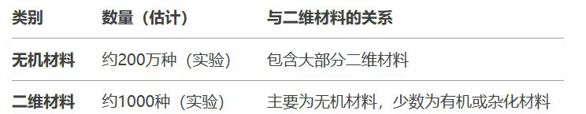

```text
研究目标：
利用扩散模型从通用晶体数据库中学习材料结构特征，通过智能优化手段，设计并生成具备以下特征的新型二维材料：
高HER催化活性（ΔG_H接近0 eV）
稳定性高（热力学与动力学稳定）
实验可合成性强（可实现制备）

方案框架

一：数据获取与预处理
爬取并整理现有的无机晶体结构数据库：Materials Project (MP)
获取二维材料数据库：C2DB、MC2D、2DMatPedia
标准化晶体结构（Pymatgen, ASE处理POSCAR、CIF文件）
提取二维材料子集数据作为微调数据集

二：晶体结构特征表示
选择有效的晶体结构标准化：SE(3)-equivariant 图神经网络 or 点云表示

三：扩散模型训练（预训练）
基于大量三维晶体数据集无条件预训练扩散模型（如MatterGen、CDVAE模型），学习结构生成能力。

四：扩散模型的微调与条件生成
利用二维材料数据子集微调模型，使其学会生成特定于二维材料的结构（迁移学习））
引入目标性质（如HER性能、稳定性）作为模型的条件输入

五：强化学习与主动优化过程
优化扩散模型训练方向
奖励：HER性能（ΔG_H ~ 0 eV）+ 稳定性（如能量靠近凸包底部）+ 合成性（结构复杂度与元素选择的简单性）
利用快速性能预测模型（如MEGNet预测ΔG_H）实时指导RL的优化过程

六：DFT精准计算与实验验证
阶段性高精度DFT计算：每隔一定优化周期（如每迭代几百次）精确计算并校验部分候选材料ΔG_H。
最终实验验证：选取最佳候选结构，用实验手段合成并测定HER催化性能。
```

```text
https://github.com/microsoft/mattergen
https://materialsproject.org/这个数据库包含无机材料的，有api接口直接爬取结构
https://cmr.fysik.dtu.dk/c2db/c2db.html这是二维材料数据库
https://icsd.products.fiz-karlsruhe.de/这是个只包含无机晶体结构的数据库
```

```text
我发您的文献一般是，
通过无机材料训练扩散模型+（稳定性+合成型）等约束条件生成新的无机结构
我的思路是，
通过无机材料训练扩散模型（引入二维材料微调）+（析氢反应性能+稳定性+合成型）等约束条件生成新的二维结构
```
## 参考资料
- ### [总结.pptx](%E6%80%BB%E7%BB%93.pptx)
- ### [扩散模型.rar](%E6%89%A9%E6%95%A3%E6%A8%A1%E5%9E%8B.rar)